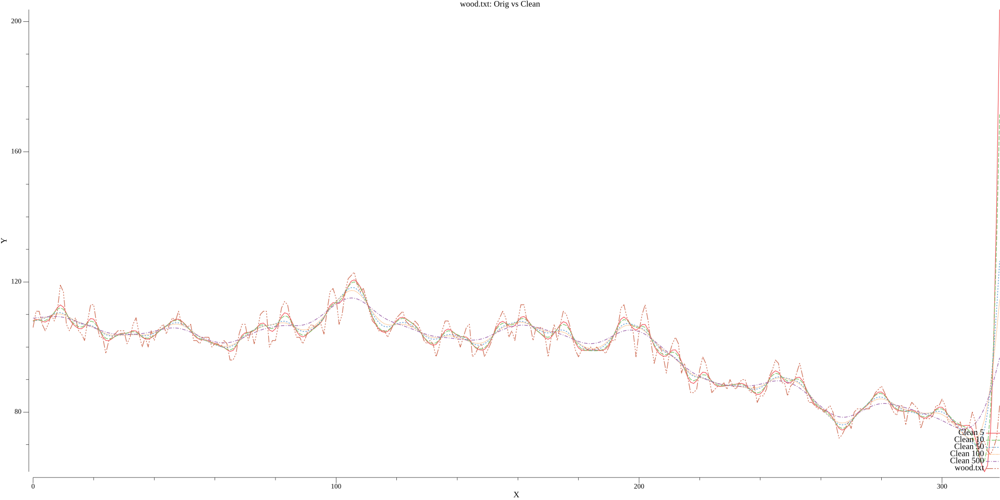
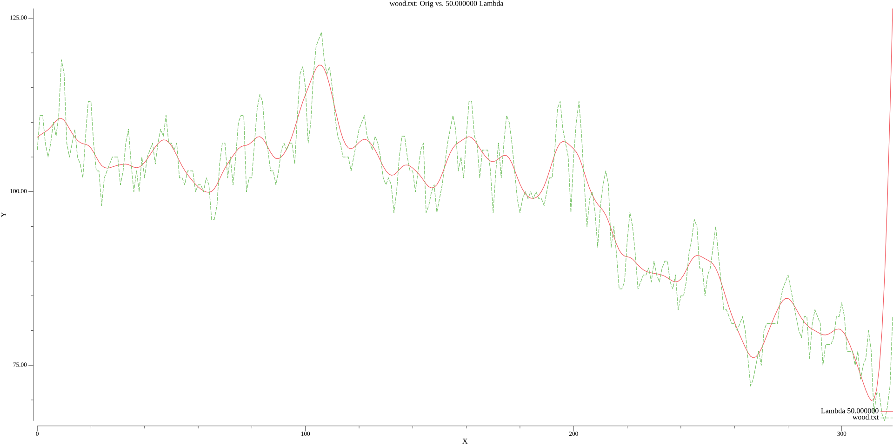

# An implementation of Whittaker-Eilers smoother in Go

This Whittaker-Eilers smoother is based on the work by Paul H.C. Eilers "A Perfect Smoother" which adds upon the
original E.T. Whittaker method. His paper and supporting info can be found at https://pubs.acs.org/doi/full/10.1021/ac034173t

Only the `whitsm.m` Matlab method has been implemented. This assumes that all the data has been sampled at equal
intervals.

A lambda value to control the amount of smoothing. The higher the value the more smoothing is applied. Note that
smoothing will remove peaks and valleys in the data, so it is not appropriate for all data sets nor all use cases.

# Usage

```go
package main

import (
    "fmt"

	smoother "github.com/grutz/go-whittaker-eilers"
)

func main() {
    data := []float64{
		-12.06249, -10.86438, -7.971472, -8.377217, -10.93501, -10.4902, -11.04855, -12.93025,
		-10.83741, -6.982948, -8.168909, -10.80393, -11.80548, -7.826278, -9.99939, -10.87981,
		-9.540166, -9.705093, -8.759284, -13.12471, -9.238223, -10.00109, -9.382297, -8.777592,
		-11.17364, -8.451718, -9.614044, -10.17361,
	}
    lambda := 10.0
	clean, err := smoother.WESmoother(data, lambda, 2)
	if err != nil {
		panic(err)
	}
	fmt.Println(clean)
}
```

# Benchmarks and Examples

## MacBook Pro (13-inch, M2, 2022)
```
goos: darwin
goarch: arm64
pkg: github.com/grutz/go-whittaker-eilers
BenchmarkWESmoother
BenchmarkWESmoother-8   	     649	   1885793 ns/op
PASS
```

## Wood Data

### Combined:


### Lambda 5:


### Lambda 10:


### Lambda 50:


### Lambda 100:


## NMR Data

Combined:


### Lambda 5:


### Lambda 10:


### Lambda 50:


### Lambda 100:
